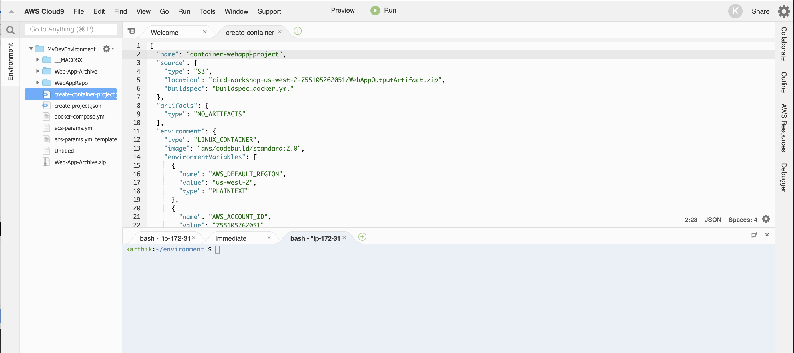
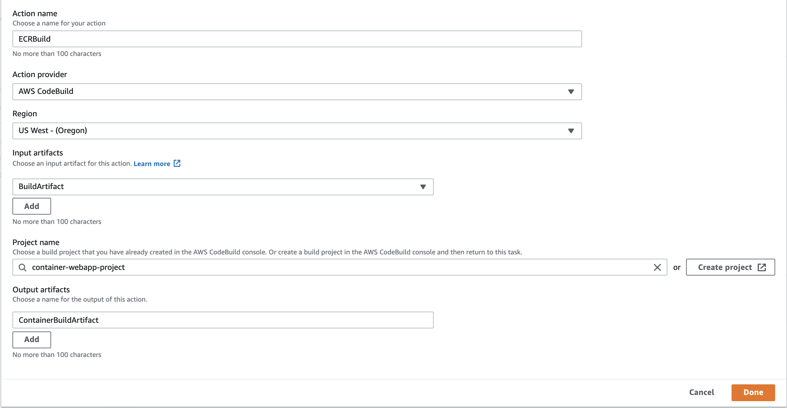
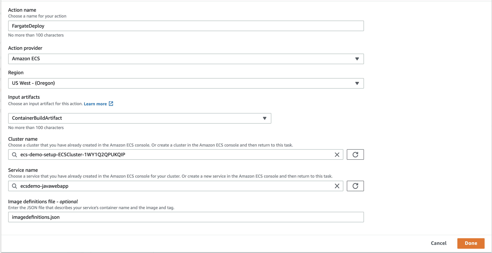
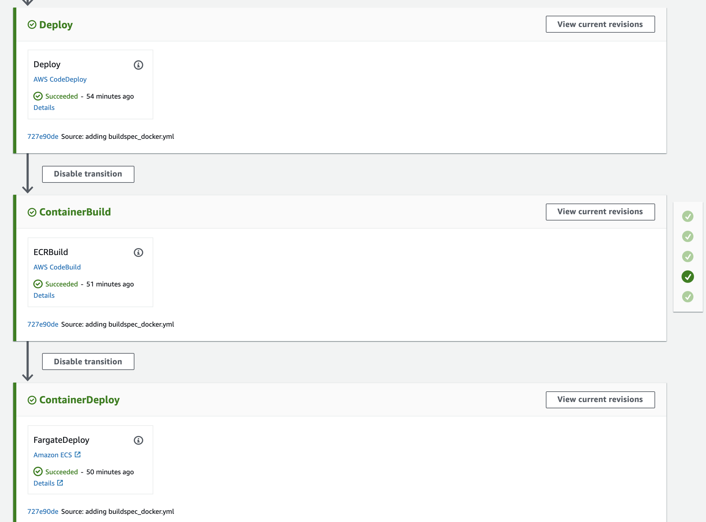

## Lab 5 - Containerize the App and deploy it on AWS Fargate

### Stage 1: Build the Environments

In the Cloud9 workspace, run the following commands:

1. Run this prerequisite commands:

```console

# Choose your region, and store it in this environment variable
user:~/environment $ cd ~/environment 
user:~/environment $ export AWS_DEFAULT_REGION=<YOUR-REGION> 
user:~/environment $ echo "export AWS_DEFAULT_REGION=$AWS_DEFAULT_REGION >> ~/.bashrc"

# Install software
user:~/environment $ sudo yum -y install jq gettext
user:~/environment $ sudo curl -so /usr/local/bin/ecs-cli https://s3.amazonaws.com/amazon-ecs-cli/ecs-cli-linux-amd64-latest
user:~/environment $ sudo chmod +x /usr/local/bin/ecs-cli

```

2. Ensure service linked roles exist for Load Balancers and ECS:

```console
user:~/environment $ aws iam get-role --role-name "AWSServiceRoleForElasticLoadBalancing" || aws iam create-service-linked-role --aws-service-name "elasticloadbalancing.amazonaws.com"

user:~/environment $ aws iam get-role --role-name "AWSServiceRoleForECS" || aws iam create-service-linked-role --aws-service-name "ecs.amazonaws.com"
```

3. Build a VPC, ECS Cluster:

```console
user:~/environment $ aws cloudformation create-stack --stack-name ecs-demo-setup --template-body https://d328byk3yyihdi.cloudfront.net/v1/cluster-fargate-vpc.yml --capabilities CAPABILITY_IAM
```
Wait for the stack to get completed. Visit Cloudformation console to check the status.

4. Build Load balancer for Webapp container.

```console
user:~/environment $ aws cloudformation create-stack --stack-name ecs-demo-alb --template-body https://d328byk3yyihdi.cloudfront.net/v1/alb-external.yml

```
Wait for the stack to get completed before proceeding to next step.

### Stage 2: Create an ECS Cluster Service for Web app deployment

1. Set environment variables from our previous build step

```console
user:~/environment $ export clustername=$(aws cloudformation describe-stacks --stack-name ecs-demo-setup --query 'Stacks[0].Outputs[?OutputKey==`ClusterName`].OutputValue' --output text)

user:~/environment $ export target_group_arn=$(aws cloudformation describe-stack-resources --stack-name ecs-demo-alb | jq -r '.[][] | select(.ResourceType=="AWS::ElasticLoadBalancingV2::TargetGroup").PhysicalResourceId')

user:~/environment $ export vpc=$(aws cloudformation describe-stacks --stack-name ecs-demo-setup --query 'Stacks[0].Outputs[?OutputKey==`VpcId`].OutputValue' --output text)

user:~/environment $ export ecsTaskExecutionRole=$(aws cloudformation describe-stacks --stack-name ecs-demo-setup --query 'Stacks[0].Outputs[?OutputKey==`ECSTaskExecutionRole`].OutputValue' --output text)

user:~/environment $ export subnet_1=$(aws cloudformation describe-stacks --stack-name ecs-demo-setup --query 'Stacks[0].Outputs[?OutputKey==`PrivateSubnetOne`].OutputValue' --output text)

user:~/environment $ export subnet_2=$(aws cloudformation describe-stacks --stack-name ecs-demo-setup --query 'Stacks[0].Outputs[?OutputKey==`PrivateSubnetTwo`].OutputValue' --output text)

user:~/environment $ export security_group=$(aws cloudformation describe-stacks --stack-name ecs-demo-setup --query 'Stacks[0].Outputs[?OutputKey==`ContainerSecurityGroup`].OutputValue' --output text)

```
This creates our infrastructure, and sets several environment variables we will use to automate deploys.


2. Configure ecs-cli to talk to your cluster:

```console
user:~/environment $ ecs-cli configure --region $AWS_DEFAULT_REGION --cluster $clustername --default-launch-type FARGATE --config-name ecs-demo

```
A cluster configuration is a set of fields that describes an Amazon ECS cluster including the name of the cluster and the region. A default cluster configuration can be set by using the ecs-cli configure default command. The Amazon ECS CLI supports the configuring of multiple named cluster configurations using the --config-name option.

3. Authorize traffic via Security Group created in setup.

```console
user:~/environment $ aws ec2 authorize-security-group-ingress --group-id "$security_group" --protocol tcp --port 8080 --cidr 0.0.0.0/0

```
We know that our containers talk on port 8080, so authorize that traffic on our security group.

4. Create ECR image repository
```console
user:~/environment $ aws ecr create-repository --repository-name javawebappdemo

```

5. Create a new file namely, **_ecs-params.yml.template_**. Copy the content below to the file and **save** it. 

```yaml
version: 1
task_definition:
  task_execution_role: $ecsTaskExecutionRole
  ecs_network_mode: awsvpc
  task_size:
    mem_limit: 0.5GB
    cpu_limit: 256
run_params:
  network_configuration:
    awsvpc_configuration:
      subnets:
        - "$subnet_1"
        - "$subnet_2"
      security_groups:
        - "$security_group"
      assign_public_ip: DISABLED
```

6. Override the variables from ecs param files with the environment variables created in previous step by runnning the below command.

```console
user:~/environment $ envsubst < ecs-params.yml.template >ecs-params.yml

```
The envsubst command templates our ecs-params.yml file with our current values. 

7. Create a new file namely, **_docker-compose.yml_**. Copy the content below to the file and **save** it.

```yaml
version: '2'
services:
  ecsdemo-javawebapp:
    image: javawebapp/latest
    ports:
      - "8080:8080"
    logging:
      driver: awslogs
      options: 
        awslogs-group: ecsdemo-javawebapp
        awslogs-region: ${AWS_DEFAULT_REGION}
        awslogs-stream-prefix: ecsdemo-javawebapp
```

8. Deploy our java webapp application:
```console
user:~/environment $ ecs-cli compose --project-name ecsdemo-javawebapp service up \
    --create-log-groups \
    --target-group-arn $target_group_arn \
    --private-dns-namespace service \
    --enable-service-discovery \
    --container-name ecsdemo-javawebapp \
    --container-port 8080 \
    --cluster-config ecs-demo \
    --vpc $vpc
```

Note: When we created the config, we had specified default launchtype of Fargate. **ecs-cli** will take care of building our private dns namespace for service discovery, and log group in cloudwatch logs.

### Stage 3: Create CodeBuild Project for building docker image

1. Let us **create CodeBuild** project from **CLI**. To create the build project using AWS CLI, we need JSON-formatted input. Execute the below commands to fill in the json file.

```console
user:~/environment/ $ echo YOUR-S3-OUTPUT-BUCKET-NAME: $(aws cloudformation describe-stacks --stack-name DevopsWorkshop-roles | jq -r '.Stacks[0].Outputs[]|select(.OutputKey=="S3BucketName")|.OutputValue')
user:~/environment/ $ echo AWS_REGION_VALUE: $AWS_DEFAULT_REGION
user:~/environment/ $ echo YOUR_AWS_ACCOUNTID: $(aws sts get-caller-identity| jq -r '.Account')
user:~/environment/ $ echo YOUR-BuildRole-ARN: $(aws cloudformation describe-stacks --stack-name DevopsWorkshop-roles | jq -r '.Stacks[0].Outputs[]|select(.OutputKey=="CodeBuildRoleArn")|.OutputValue')

```

2. **_Create_** a json file named **_'create-container-project.json'_** under 'MyDevEnvironment'. 
     
    Copy the content below to create-project.json. (Replace the placeholders marked with **_<<>>_** with  values for BuildRole ARN, S3 Output Bucket and region from the previous step.) 

```json
{
  "name": "container-webapp-project",
  "source": {
    "type": "S3",
    "location": "<<YOUR-S3-OUTPUT-BUCKET-NAME>>/WebAppOutputArtifact.zip",
    "buildspec": "buildspec_docker.yml"
  },
  "artifacts": {
    "type": "NO_ARTIFACTS"
  },
  "environment": {
    "type": "LINUX_CONTAINER",
    "image": "aws/codebuild/standard:2.0",
    "environmentVariables": [
      {
        "name": "AWS_DEFAULT_REGION",
        "value": "<<REPLACE_AWS_REGION_VALUE>>",
        "type": "PLAINTEXT"
      },
      {
        "name": "AWS_ACCOUNT_ID",
        "value": "<<REPLACE_YOUR_AWS_ACCOUNTID>>",
        "type": "PLAINTEXT"
      },
      {
        "name": "IMAGE_REPO_NAME",
        "value": "javawebappdemo",
        "type": "PLAINTEXT"
      },
      {
        "name": "IMAGE_TAG",
        "value": "latest",
        "type": "PLAINTEXT"
      }
    ],
    "computeType": "BUILD_GENERAL1_SMALL",
    "privilegedMode": true
  },
  "serviceRole": "<<REPLACE-YOUR-BuildRole-ARN>>"
}
```

3. Switch to the directory that contains the file you just saved, and run the **_create-project_** command:

```console
user:~/environment $ aws codebuild create-project --cli-input-json file://create-container-project.json
```

### Stage 3: Modify CodePipeline to include ECS build and deploy

In this step, you will add a new stages to your pipeline, and then add an action for building and deploying docker image.

1. **Edit** the pipeline. Choose the option to add a stage after the **Deploy** stage with the AWS CodeDeploy action. Type a name for the stage (for example, **ContainerBuild**).

2. Choose **+ Add action group**,
- Type a name for your action (for example, **ECRBuild**).
- For **Action Provider**, choose **AWS CodeBuild**.
- In **Input artifacts**: select the **BuildArtifact**
- In **Project name**, and **Select** an **container-webapp-project**
- In **Output artifacts**: Type  **ContainerBuildArtifact**

3. Choose **Done**.



4. Choose the option to add a stage after the **ContainerBuild** stage with the AWS CodeDeploy action. Type a name for the stage (for example, **ContainerDeploy**).

5. Choose **+ Add action group**,
- Type a name for your action (for example, **FargateDeploy**).
- For **Action Provider**, choose **Amazon ECS**.
- In **Input artifacts**: select the **ContainerBuildArtifact**
- In **Cluster   name**, and **Select**  the cluster starting with **ecs-demo-setup-ECSCluster**
- In **Service   name**, and **Select**  the cluster starting with **ecsdemo-javawebapp**
- In **Image definitions file**: Type  **imagedefinitions.json**

6. Choose **Done**.



7. Save changes to pipeline by clicking **Save** button on top of the page.

### Stage 4: Modify buildspec files for ECS deployment

1. Create a file namely, **_buildspec_docker.yml_** under **WebAppRepo** folder. Copy the content below to the file and **save** it. 

```yaml
version: 0.2 
 
phases: 
  install: 
    runtime-versions: 
      docker: 18 
  pre_build: 
    commands: 
      - echo Logging in to Amazon ECR... 
      - $(aws ecr get-login --no-include-email --region $AWS_DEFAULT_REGION) 
  build: 
    commands: 
      - echo Build started on `date` 
      - echo Building the Docker image...           
      - docker build -t $IMAGE_REPO_NAME:$IMAGE_TAG . 
      - docker tag $IMAGE_REPO_NAME:$IMAGE_TAG $AWS_ACCOUNT_ID.dkr.ecr.$AWS_DEFAULT_REGION.amazonaws.com/$IMAGE_REPO_NAME:$IMAGE_TAG       
  post_build: 
    commands: 
      - echo Build completed on `date` 
      - echo Pushing the Docker image... 
      - docker push $AWS_ACCOUNT_ID.dkr.ecr.$AWS_DEFAULT_REGION.amazonaws.com/$IMAGE_REPO_NAME:$IMAGE_TAG 
      - printf '[{"name":"ecsdemo-javawebapp","imageUri":"%s"}]' $AWS_ACCOUNT_ID.dkr.ecr.$AWS_DEFAULT_REGION.amazonaws.com/$IMAGE_REPO_NAME:$IMAGE_TAG > imagedefinitions.json
artifacts:
  files: imagedefinitions.json    

```
2. Modify the existing buildspec file namely, **_buildspec.yml_** under **WebAppRepo** folder. We need to include additional files to the artifact to dockerize the webapp. Copy the content below to the file and **save** it. 

```yaml
version: 0.2
 
phases: 
  install: 
    commands: 
      - echo Nothing to do in the install phase... 
  pre_build: 
    commands: 
      - echo Nothing to do in the pre_build phase... 
  build: 
    commands: 
      - echo Build started on `date` 
      - mvn install 
  post_build: 
    commands: 
      - echo Build completed on `date` 
artifacts: 
  files: 
    - appspec.yml 
    - scripts/**/* 
    - target/javawebdemo.war 
    - Dockerfile 
    - buildspec_docker.yml 
    - docker/**/* 

```

3. Commit & push the build specification files to repository

```console
user:~/environment/WebAppRepo/ $ git add *
user:~/environment/WebAppRepo/ $ git commit -m "adding buildspec_docker.yml"
user:~/environment/WebAppRepo/ $ git push -u origin master
```

Check the pipeline for detecting the commit changes and executing the steps.



4. Once the pipeline succeed in depoying the code to Fargate, test the page by using the below url.

```console
#Check reachability (open url in your browser):
user:~/environment/WebAppRepo/ $ aws cloudformation describe-stacks --stack-name ecs-demo-alb --query 'Stacks[0].Outputs[?OutputKey==`ExternalUrl`].OutputValue' --output text  
```

### Summary

This **concludes Lab 5**. In this lab, we successfully created an ECS environment for  deploying java web app. We also setup a CodeBuild project to build the docker image from the previous built Java war. We also modified CodePipeline to include stage for Container Build and ECS deployment. We also successfully completed continuous deployment of same application to both EC2 and Servless ECS Fargate environemnt. You can now move to the next Lab,
